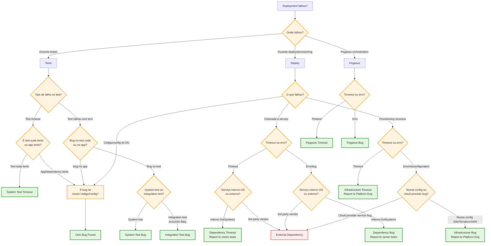

# Root Cause Categorization - Decision Tree

*Guia de decisão para escolher a categoria correta de Root Cause*

---

## 🌳 Decision Tree (Visual)

---

## 📝 Decision Tree (Texto)

### Passo 1: Onde falhou o deployment?

**A) Durante TESTES (System Tests ou Integration Tests)**
→ Ir para [Fluxo: Testes](#fluxo-testes)

**B) Durante DEPLOY/PROVISIONING**
→ Ir para [Fluxo: Deploy](#fluxo-deploy)

**C) Durante PEGASUS ORCHESTRATION**
→ Ir para [Fluxo: Pegasus](#fluxo-pegasus)

---

### Fluxo: Testes

#### Qual foi o tipo de falha?

**1. Test TIMEOUT**
- ❓ O timeout foi porque o **test suite é lento** (muitos testes, test infra lenta)?
  - ✅ **System Test Timeout**
- ❓ O timeout foi porque **app/dependency é lento** (endpoint demora, query lenta)?
  - ➡️ Ir para [Fluxo: Deploy - Bug no nosso código](#nossa-aplicação)

**2. Test FALHOU com erro**
- ❓ O erro está no **test code** (assertion errada, test data fixture errada, test env misconfigured, **timing issues, flakiness**)?
  - ❓ É System Test ou Integration Test?
    - System Test → ✅ **System Test Bug**
    - Integration Test → ✅ **Integration Test Bug**
- ❓ O erro está no **app code** (bug de lógica, API retorna erro)?
  - ➡️ Ir para [Fluxo: Deploy - Bug no nosso código](#nossa-aplicação)

---

### Fluxo: Deploy

#### O que falhou durante o deploy?

**1. CHAMADA A SERVIÇO (timeout ou erro)**

##### Timeout:
- ❓ O serviço é **interno OutSystems** (Identity, RDOS, Maestro, outro DU interno)?
  - ✅ **Dependency Timeout**
  - 📢 Report to owner team (use Backstage)
- ❓ O serviço é **3rd party/vendor** (AWS, Azure, GitHub, npm registry)?
  - ✅ **External Dependency**

##### Erro/Bug:
- ❓ O serviço é **interno OutSystems**?
  - ✅ **Dependency Bug**
  - 📢 Report to owner team (use Backstage)
- ❓ O serviço é **3rd party/vendor**?
  - ✅ **External Dependency**

---

**2. PROVISIONING DE RECURSOS (nodes, databases, load balancers)**

##### Timeout:
- ✅ **Infrastructure Timeout**
- 📢 Report to Platform Engineering

##### Erro/Misconfiguration:
- ❓ É problema na **nossa configuração** (Kubernetes config, Terraform/Helm template, IAM permissions, network rules)?
  - ✅ **Infrastructure Bug**
  - 📢 Report to Platform Engineering
- ❓ É bug no **serviço do cloud provider** (AWS EKS control plane failure, Azure API error)?
  - ✅ **External Dependency**

---

**3. CÓDIGO/CONFIGURAÇÃO DO NOSSO DU** {#nossa-aplicação}
- Bug no código da aplicação
- Configuração errada (env vars, missing dependencies)
- Lógica errada

✅ **Own Bug Found**

---

### Fluxo: Pegasus

#### Qual foi o tipo de falha?

**1. TIMEOUT**
- Pegasus orchestrator demorou muito
- Step específico excedeu timeout

✅ **Pegasus Timeout**

**2. ERRO**
- Pegasus crashed com exception
- Pegasus API retornou erro
- Pegasus parsing error

✅ **Pegasus Bug**

---

## 🎯 Quick Reference Table

| Categoria | Quando Usar | Reportar a |
|-----------|-------------|------------|
| **Own Bug Found** | Bug no código/config do nosso DU | — |
| **Dependency Timeout** | Chamada a serviço **interno OS** timeout | Owner team (Backstage) |
| **Dependency Bug** | Serviço **interno OS** retorna erro/bug | Owner team (Backstage) |
| **Infrastructure Timeout** | Provisioning de recursos timeout | Platform Engineering |
| **Infrastructure Bug** | **Nossa** infra config errada (K8s/Terraform/IAM) | Platform Engineering |
| **Integration Test Bug** | Bug no test code (incl. flakiness, timing) | — |
| **System Test Bug** | Bug no system test code | — |
| **System Test Timeout** | Test suite demora muito (não app) | — |
| **Pegasus Timeout** | Pegasus orchestration timeout | — |
| **Pegasus Bug** | Pegasus platform error | — |
| **External Dependency** | **3rd party/vendor** (AWS, Azure, npm, GitHub) | — (vendor-managed) |

---

## 🔍 Edge Cases - Decision Guide

| Cenário | Categoria Correta | Porquê |
|---------|-------------------|--------|
| AWS SDK throws exception | External Dependency | AWS é vendor, não gerimos SDK |
| Identity Service 500 error | Dependency Bug | Identity é interno OS |
| Test falha por race condition | Integration Test Bug | Flakiness fica em Integration Test Bug |
| Kubernetes pod stuck "Pending" | Infrastructure Timeout | Provisioning lento |
| IAM permission missing | Infrastructure Bug | Nossa configuração IAM |
| Azure EKS control plane down | External Dependency | Cloud provider service bug |
| RDOS timeout durante introspection | Dependency Timeout | RDOS é serviço interno OS |
| Public npm package regression | External Dependency | npm público = 3rd party |
| Test assertion incorreta | System/Integration Test Bug | Bug no test code |
| App endpoint lento causa test timeout | Own Bug Found | Performance issue no app |

---

## 📋 Checklist de Validação

Antes de escolher categoria, confirma:

- [ ] Identifiquei **onde** falhou (tests, deploy, pegasus)?
- [ ] Se foi dependency/infra, distingui **interno OS** vs **3rd party**?
- [ ] Se foi test, distingui **bug no test** vs **bug no app**?
- [ ] Se foi Infrastructure Bug, confirmo que é **nossa config** (não cloud provider bug)?
- [ ] Li a [nota do External Dependency](#external-dependency-note)?

### External Dependency Note

Use **External Dependency** apenas para:
- ✅ Cloud provider service bugs/outages (AWS, Azure, GCP)
- ✅ Public packages (npm, NuGet, Maven)
- ✅ External SaaS platforms (GitHub, Datadog)

**NÃO use** para:
- ❌ Serviços internos OutSystems (use Dependency Bug/Timeout)
- ❌ Nossa configuração de infra (use Infrastructure Bug)

---

*Última atualização: 2026-03-30*
