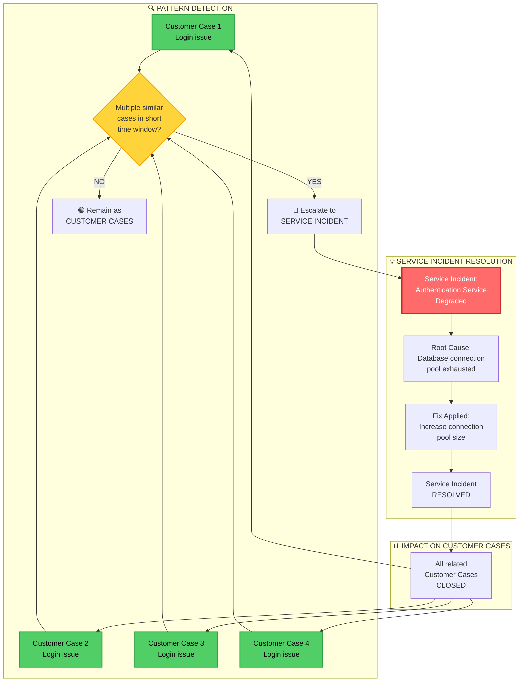

# Service Incident ↔ Customer Incident Relationship

*Dynamic relationship and pattern detection*

---

## The Relationship



---

## Scenario 1: Multiple Customer Cases → Service Incident

### Visual Flow

```
TIME →

09:00  Customer A reports: "Can't login"
       🟢 Customer Case created
       Support investigates → Customer-specific?

09:15  Customer B reports: "Login failing"
       🟢 Customer Case created
       Support notices: "Same symptom as Customer A"

09:25  Customer C reports: "Authentication error"
       🟢 Customer Case created

09:30  Customer D reports: "Can't access app"
       🟢 Customer Case created

       ⚠️  PATTERN DETECTED
       → 4 customers, same issue, 30-minute window
       → Not customer-specific configurations

09:35  🔴 ESCALATE TO SERVICE INCIDENT
       "Authentication service degraded"

       → All 4 Customer Cases linked to Service Incident
       → Engineering investigates systemic cause
       → Root cause: database connection pool exhausted

10:30  Service Incident RESOLVED
       → All 4 Customer Cases automatically CLOSED
```

---

## Scenario 2: Service Incident → Multiple Customer Cases

### Visual Flow

```
┌────────────────────────────────────────────────────┐
│  🔴 SERVICE INCIDENT                               │
│  Deployment failure in EU region                   │
│  Impact: All customers in EU-Central-1             │
└────────────────┬───────────────────────────────────┘
                 │
                 │ MANIFESTS AS ▼
                 │
    ┌────────────┼────────────┬────────────┐
    │            │            │            │
    ▼            ▼            ▼            ▼
┌─────────┐ ┌─────────┐ ┌─────────┐ ┌─────────┐
│Customer │ │Customer │ │Customer │ │Customer │
│  Case 1 │ │  Case 2 │ │  Case 3 │ │  Case 4 │
│         │ │         │ │         │ │         │
│"Deploy  │ │"App not │ │"Can't   │ │"Publish │
│ failed" │ │updating"│ │publish" │ │ error"  │
└─────────┘ └─────────┘ └─────────┘ └─────────┘
    🟢          🟢          🟢          🟢

All linked to parent Service Incident
Support directs customers to Status Page
When Service Incident resolved → All cases closed
```

---

## Pattern Detection Rules

### When to Escalate Customer Cases → Service Incident

| Trigger | Threshold | Action |
|---------|-----------|--------|
| **Volume spike** | > 3 similar cases in 30 minutes | Investigate for Service Incident |
| **Same symptom** | > 5 customers report identical error message | Escalate to Service Incident |
| **Geographic pattern** | Multiple customers in same region/environment | Check for regional Service Incident |
| **Time correlation** | Cases spike after deployment or config change | Investigate recent changes |
| **Core journey broken** | Multiple customers can't complete same user journey | Escalate to Service Incident |

### Automated Detection (Future)

- Monitor Support Case creation rate
- Pattern matching on error messages
- Geographic clustering analysis
- Correlation with deployment events
- Alert Support + Engineering when thresholds exceeded

---

## Decision Matrix

```
┌─────────────────────────────────────────────────────────┐
│  HOW MANY CUSTOMERS AFFECTED?                           │
└────────────┬───────────────────────────────────────────┘
             │
    ┌────────┴────────┐
    │                 │
   ONE            MULTIPLE
    │                 │
    ▼                 ▼
┌─────────┐     ┌──────────┐
│Customer │     │Is there a│
│Incident │     │common    │
│         │     │root      │
│🟢       │     │cause?    │
└─────────┘     └────┬─────┘
                     │
            ┌────────┴────────┐
            │                 │
           YES               NO
            │                 │
            ▼                 ▼
      ┌──────────┐      ┌──────────┐
      │Service   │      │Multiple  │
      │Incident  │      │Customer  │
      │          │      │Incidents │
      │🔴        │      │(unrelated)│
      └──────────┘      └──────────┘
                             🟢🟢🟢
```

---

## Real Examples

### Example 1: Pattern Detection → Service Incident

**Timeline:**
- **T+0:** Customer A: "Can't deploy app in EU"
- **T+5:** Customer B: "Deploy timeout in EU"
- **T+10:** Customer C: "EU deployment failing"
- **T+15:** ⚠️ **Pattern detected** → 3 customers, same region, 15 minutes
- **T+20:** 🔴 **Service Incident declared:** "Deployment service degraded in EU-Central-1"
- **T+45:** Root cause identified: Kubernetes API server overloaded
- **T+90:** Fix deployed, Service Incident resolved
- **Result:** All 3 Customer Cases closed automatically

---

### Example 2: Service Incident Generating Customer Cases

**Timeline:**
- **T+0:** 🔴 **Service Incident:** Database migration fails, authentication service down
- **T+2:** Customer A opens case: "Can't login"
- **T+5:** Customer B opens case: "Authentication error"
- **T+8:** Customer C opens case: "Login page not loading"
- **T+10:** Customer D opens case: "App shows login error"
- **Action:** Support links all cases to Service Incident, directs to Status Page
- **T+60:** Service Incident resolved (database migration completed)
- **Result:** All 4 Customer Cases closed with reference to resolved Service Incident

---

### Example 3: False Pattern (No Service Incident)

**Timeline:**
- **T+0:** Customer A: "Can't access app"
  - Investigation: Customer's IP whitelisting misconfigured
- **T+10:** Customer B: "Login failing"
  - Investigation: Customer's SSO certificate expired
- **T+20:** Customer C: "Authentication error"
  - Investigation: Customer's Active Directory down
- **Analysis:** 3 customers, authentication-related, BUT different root causes
- **Decision:** ✅ Remain as separate Customer Incidents (no Service Incident)

---

## Key Takeaways

### 1. Dynamic Classification
- Initial triage may classify as Customer Incident
- Pattern detection may escalate to Service Incident
- Classification can change based on emerging data

### 2. Bi-directional Relationship
- **Bottom-up:** Multiple Customer Cases → reveal Service Incident
- **Top-down:** Service Incident → generates Customer Cases

### 3. Importance of Linking
- Always link Customer Cases to parent Service Incident
- When Service Incident resolved → close linked Customer Cases
- Historical data helps pattern detection

### 4. Support + Engineering Collaboration
- Support monitors for patterns
- Engineering investigates systemic issues
- Feedback loop improves pattern detection over time

---

## OLA Implications

### When Pattern Detected

**Support responsibilities:**
1. Recognize pattern (manual or automated)
2. Escalate to Service Incident
3. Link all related Customer Cases
4. Update customers with Status Page link

**Engineering responsibilities:**
1. Acknowledge Service Incident
2. Investigate root cause
3. Provide status updates
4. Notify Support when resolved

**Shared:**
- Define pattern detection thresholds
- Review false positives/negatives
- Refine detection rules over time

---

## Metrics to Track

| Metric | Purpose |
|--------|---------|
| **Time to pattern detection** | How quickly do we identify that Customer Cases are actually a Service Incident? |
| **False positive rate** | How often do we escalate to Service Incident when it's not? |
| **False negative rate** | How often do we miss patterns (Service Incident not declared)? |
| **Customer Cases linked to Service Incidents** | % of Customer Cases that are symptoms of Service Incidents |
| **Pattern detection accuracy** | % of correct escalations based on pattern |

---

*Created: 2026-03-25*
*Related: M3.3 - Triage Models & OLAs*
