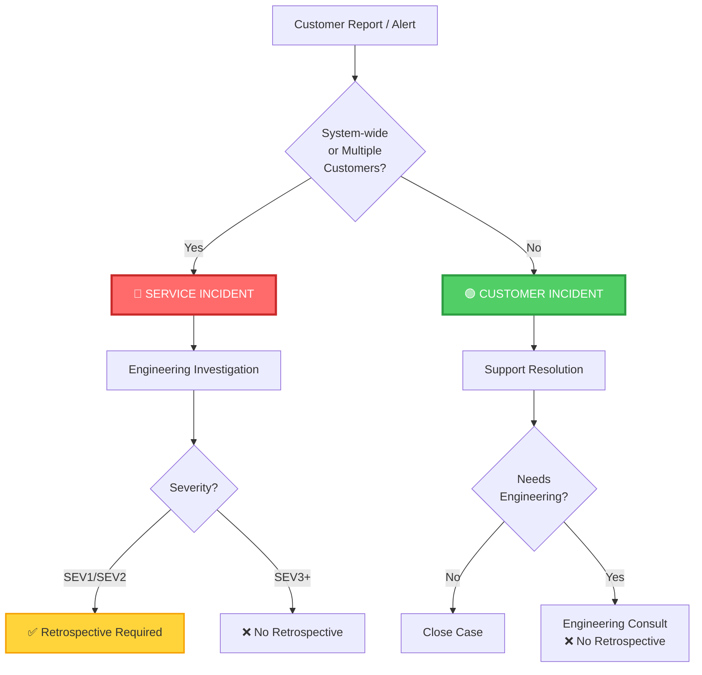

# Service Incident vs Customer Incident

*Visual guide for M3.3 - Triage Models & OLAs*

---

## Decision Tree

```
Customer Report / Alert
         │
         ▼
    [TRIAGE QUESTION]
    Does this affect the service
    or multiple customers?
         │
    ┌────┴────┐
    │         │
   YES       NO
    │         │
    ▼         ▼
SERVICE   CUSTOMER
INCIDENT  INCIDENT
```

---

## Comparison Table

| Characteristic | 🔴 Service Incident | 🟢 Customer Incident (Support Case) |
|----------------|-------------------|----------------------------------|
| **Scope** | System-wide or multiple customers | Single customer or specific configuration |
| **Impact** | Service degradation or failure | Customer-specific issue |
| **Root Cause** | Platform/service bug or infrastructure issue | Configuration, data, or usage issue |
| **Example 1** | API endpoint down for all customers | Customer misconfigured authentication settings |
| **Example 2** | Deployment failure affecting all tenants | Customer data import failed due to format error |
| **Example 3** | Authentication service degraded | Customer hitting rate limit due to their usage pattern |
| **Who Leads** | Engineering (with Support coordination) | Support (may consult Engineering) |
| **Retrospective?** | ✅ Yes (if SEV1/SEV2) | ❌ No |
| **OLA** | Support → Engineering handoff with timeline | Support owns, may escalate for consultation |

---

## Visual Flow



---

## Key Questions for Triage

**Ask these questions to classify:**

1. **Is this affecting multiple customers?**
   - Yes → Service Incident
   - No → Continue to Q2

2. **Is there evidence of service degradation?**
   - Yes → Service Incident
   - No → Continue to Q3

3. **Is a core user journey broken for everyone?**
   - Yes → Service Incident
   - No → Continue to Q4

4. **Is this specific to customer configuration or data?**
   - Yes → Customer Incident
   - No → Escalate for classification

---

## Examples

### 🔴 Service Incidents

| Scenario | Why Service Incident |
|----------|---------------------|
| Login fails for all users in EU region | System-wide, multiple customers affected |
| Deployment system timing out for all tenants | Platform failure, impacts all |
| API returning 500 errors across all environments | Service degradation, systemic |
| Authentication service response time > 10s | Performance degradation affecting service |

### 🟢 Customer Incidents (Support Cases)

| Scenario | Why Customer Incident |
|----------|---------------------|
| Customer A can't login due to wrong SSO config | Configuration issue, isolated to one customer |
| Customer B's data import failed | Customer-specific data issue |
| Customer C hitting rate limits | Usage pattern, not service failure |
| Customer D's app slow due to inefficient query | Code quality issue in customer app |

---

## Salesforce Model Reference

**Salesforce distinguishes:**

- **Service Incident:** Trust.salesforce.com issue - affects platform availability, performance, or functionality for multiple customers
- **Customer Case:** Individual customer issue - specific to their org, configuration, code, or data

**We apply the same logic:**
- Service Incident = ODC platform issue affecting service delivery
- Customer Incident = Customer-specific configuration, code, or data issue

---

## OLA Overview (Support → Engineering)

When a **Service Incident** is identified:

1. **Support triages** using heuristic
2. **Handoff to Engineering** with clear context:
   - Severity classification
   - Impacted customers/regions
   - Symptoms observed
   - Initial troubleshooting done
3. **Engineering investigates** and resolves
4. **Retrospective conducted** (if SEV1/SEV2)

**OLA Timelines (to be defined in M3.3 proposal):**
- Support acknowledgement: X minutes
- Engineering assignment: Y minutes
- Initial status update: Z minutes

---

## Benefits of Clear Classification

✅ **For Support:**
- Clear escalation criteria
- Reduced back-and-forth with Engineering
- Faster resolution for customer-specific issues

✅ **For Engineering:**
- Focus on systemic problems
- Reduced interruptions for customer-specific issues
- Better context when Support escalates

✅ **For Customers:**
- Faster resolution (right team, first time)
- Appropriate urgency applied
- Clear communication on impact

---

*Created: 2026-03-25*
*Related: M3.3 - Triage Models & OLAs*
*Confluence: [Service Incidents versus Customer Incidents](https://outsystemsrd.atlassian.net/wiki/spaces/EEO/pages/4411654330/Service+Incidents+versus+Customer+Incidents)*
