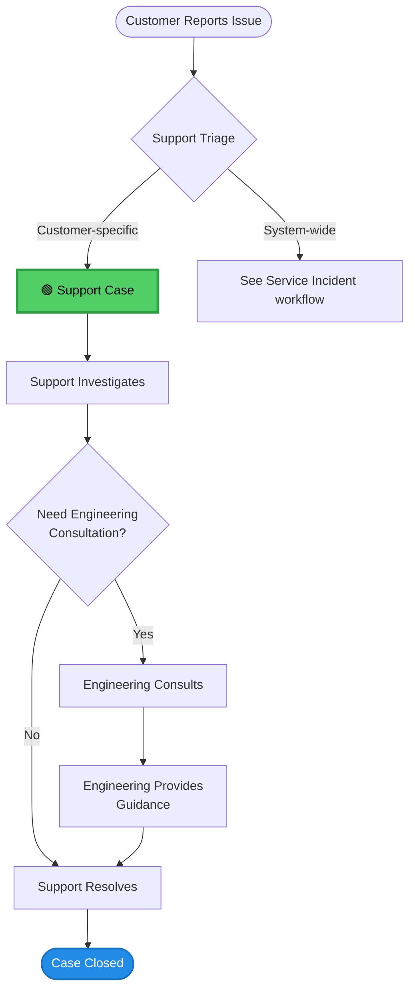
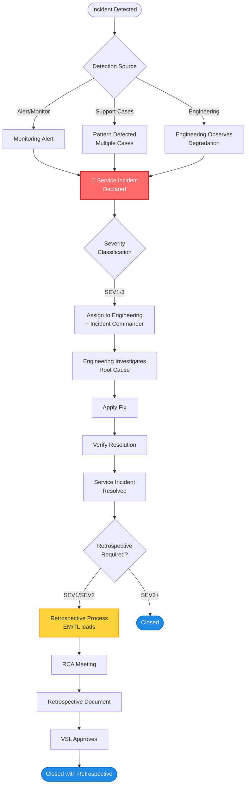

# Workflows: Support Case vs Service Incident

*Visual workflow designs for M3.3*

---

## Workflow 1: Support Case (Customer Incident)



### Detailed Steps: Support Case

| Step | Owner | Actions | Timeline |
|------|-------|---------|----------|
| **1. Customer Reports** | Customer | Opens support ticket describing issue | T+0 |
| **2. Triage** | Support | Classifies as Support Case vs Service Incident using heuristic | T+15 min |
| **3. Initial Investigation** | Support | Reviews logs, configuration, customer environment | T+30 min |
| **4. Decision Point** | Support | Can we resolve with Support knowledge? | T+1 hour |
| **5a. Support Resolution** | Support | Apply fix, provide guidance, close case | T+2 hours |
| **5b. Engineering Consult** | Support + Engineering | Request Engineering input (not full handoff) | T+4 hours |
| **6. Apply Solution** | Support | Implement Engineering guidance | T+6 hours |
| **7. Close** | Support | Verify resolution, close case | T+8 hours |

### Key Characteristics: Support Case
- ✅ Customer owns the resolution with Support guidance
- ✅ No retrospective required
- ✅ Engineering may consult but doesn't take ownership
- ✅ Closed when customer's specific issue is resolved

---

## Workflow 2: Service Incident



### Detailed Steps: Service Incident

| Step | Owner | Actions | Timeline (Target OLA) |
|------|-------|---------|----------------------|
| **1. Detection** | Monitoring / Support / Engineering | Alert triggers, pattern detected, or observed | T+0 |
| **2. Declare Incident** | Support / Engineering | Create Service Incident ticket, classify severity | T+5 min |
| **3. Assign** | Incident Commander / Engineering Manager | Assign to responsible team + Incident Commander | T+15 min |
| **4. Investigate** | Engineering + Incident Commander | Root cause analysis, troubleshooting | T+30 min to hours |
| **5. Fix** | Engineering | Deploy fix, rollback, or workaround | Depends on severity |
| **6. Verify** | Engineering + Support | Confirm service restored, monitor stability | T+resolution + 30 min |
| **7. Resolve** | Incident Commander | Mark Service Incident as resolved | When verified stable |
| **8a. SEV3+ Close** | Engineering Manager | Close without retrospective | T+resolution + 1 day |
| **8b. SEV1/SEV2 Retrospective** | EM/TL of incident-causing team | Lead retrospective process (new model) | T+resolution + 3 days |
| **9. RCA Meeting** | EM/TL + SRE + Quality + Dev teams | Conduct RCA working session | T+resolution + 7 days |
| **10. Retrospective Doc** | EM/TL (can delegate writing) | Complete retrospective document | T+resolution + 14 days |
| **11. Approve** | Value Stream Leader | Review and approve retrospective | T+resolution + 21 days |
| **12. Close** | Engineering Manager | Close Service Incident | T+resolution + 25 days |

### Key Characteristics: Service Incident
- ✅ Engineering owns resolution
- ✅ Retrospective required for SEV1/SEV2
- ✅ EM/TL of incident-causing team accountable for retrospective
- ✅ Closed when service is restored AND retrospective complete (if required)

---

## Side-by-Side Comparison

### Visual Layout Suggestion

```
┌─────────────────────────────────┐  ┌─────────────────────────────────┐
│     SUPPORT CASE WORKFLOW       │  │  SERVICE INCIDENT WORKFLOW      │
│                                 │  │                                 │
│  Customer Reports               │  │  Detection (Alert/Pattern)      │
│         ↓                       │  │         ↓                       │
│  Support Triage                 │  │  Declare Service Incident       │
│         ↓                       │  │         ↓                       │
│  Support Investigates           │  │  Assign to Engineering          │
│         ↓                       │  │         ↓                       │
│  Need Engineering?              │  │  Engineering Investigates       │
│    ├─No → Support Resolves      │  │         ↓                       │
│    └─Yes → Eng Consults         │  │  Fix Applied                    │
│              ↓                  │  │         ↓                       │
│         Support Resolves        │  │  Verify Resolution              │
│              ↓                  │  │         ↓                       │
│         CLOSED                  │  │  Retrospective? (SEV1/SEV2)     │
│                                 │  │    ├─No → CLOSED                │
│  🟢 Customer-specific           │  │    └─Yes → RCA → CLOSED         │
│  ⏱️ Hours to days               │  │                                 │
│  👤 Support owns                │  │  🔴 System-wide                 │
│                                 │  │  ⏱️ Hours to weeks              │
│                                 │  │  👨‍💻 Engineering owns            │
└─────────────────────────────────┘  └─────────────────────────────────┘
```

---

## Key Decision Points

### For Support Case:
```
Question 1: Is this customer-specific or system-wide?
   └─ Customer-specific → Support Case

Question 2: Can Support resolve with existing knowledge?
   └─ No → Request Engineering consultation
   └─ Yes → Support resolves directly

Question 3: Is issue resolved for customer?
   └─ Yes → Close case
```

### For Service Incident:
```
Question 1: Is this affecting service or multiple customers?
   └─ Yes → Service Incident

Question 2: What severity?
   └─ SEV1/SEV2 → Retrospective required
   └─ SEV3+ → No retrospective

Question 3: Is service restored and stable?
   └─ Yes → Move to retrospective (if required)
   └─ No → Continue investigation

Question 4: Is retrospective complete?
   └─ Yes → Close Service Incident
   └─ N/A (SEV3+) → Close immediately
```

---

## OLA Summary

### Support Case OLAs (Proposed)

| Metric | Target |
|--------|--------|
| Time to triage | < 15 min |
| Time to initial response | < 30 min |
| Time to Engineering consultation (if needed) | < 4 hours |
| Time to resolution | < 24 hours (P1), < 3 days (P2), < 7 days (P3) |

### Service Incident OLAs (Proposed)

| Metric | Target |
|--------|--------|
| Time to declare | < 5 min from detection |
| Time to assign Engineering | < 15 min |
| Time to initial status update | < 30 min |
| Time to start retrospective | < 3 days from resolution (SEV1/SEV2) |
| Time to complete retrospective | < 45 days from resolution |

---

## Visual Design Recommendations

### Support Case Diagram
- **Color:** Green (#51cf66) for boxes
- **Icons:**
  - 👤 Customer at start
  - 🎧 Support agent throughout
  - 👨‍💻 Engineering (dotted line, consult only)
  - ✅ Checkmark at close
- **Style:** Simple, linear flow (mostly straight down)

### Service Incident Diagram
- **Color:** Red (#ff6b6b) for incident boxes, Yellow (#ffd43b) for retrospective
- **Icons:**
  - 🚨 Alert/detection at start
  - 👨‍💻 Engineering throughout
  - 📋 Retrospective document
  - 👔 VSL approval
  - ✅ Checkmark at close
- **Style:** Branching flow (SEV1/2 vs SEV3+)

### Side-by-Side Layout
- Place Support Case on LEFT (simpler, faster)
- Place Service Incident on RIGHT (more complex, longer)
- Use vertical alignment to show parallel steps where applicable
- Highlight key differences:
  - Owner (Support vs Engineering)
  - Timeline (hours vs days/weeks)
  - Retrospective (No vs Yes for SEV1/2)

---

## Handoff Points (OLA Critical)

### Support → Engineering (Service Incident Declaration)

**Support provides:**
- Severity classification
- Initial symptoms observed
- Number of customers affected
- Time first detected
- Related Support Cases (if pattern-detected)

**Engineering acknowledges:**
- Assignment within 15 min
- Initial status update within 30 min

---

### Engineering → Support (Resolution Communication)

**Engineering provides:**
- Root cause summary
- Fix applied
- Service stability confirmation
- Customer communication guidance

**Support actions:**
- Update linked Support Cases
- Communicate to affected customers
- Monitor for recurrence

---

*Created: 2026-03-25*
*Related: M3.3 - Triage Models & OLAs*
